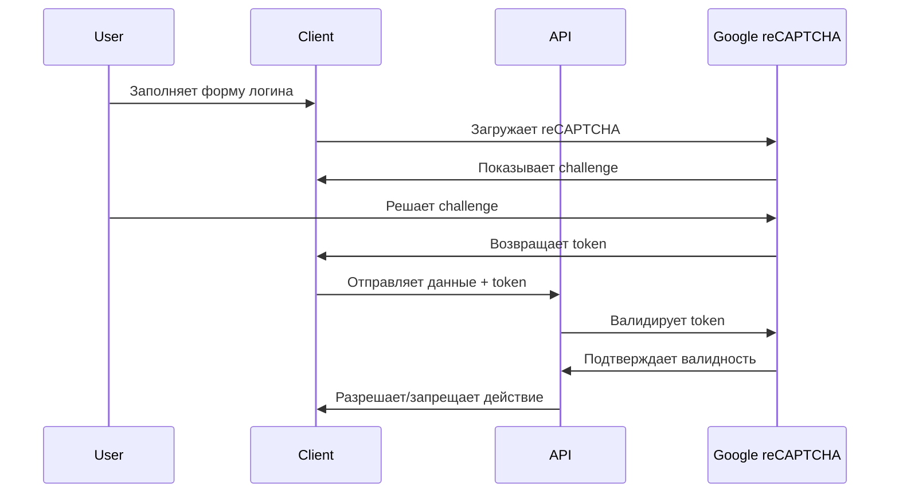

# Настройка Google reCAPTCHA

## Обзор

В этом проекте реализована комплексная система защиты от ботов с помощью Google reCAPTCHA. Система поддерживает как reCAPTCHA v2 (checkbox), так и v3 (score-based), и может быть легко настроена через админ панель.

## Возможности

- ✅ **reCAPTCHA v2** (Checkbox) - видимая защита с галочкой "Я не робот"
- ✅ **reCAPTCHA v3** - невидимая защита на основе скоринга
- ✅ **Гибкая конфигурация** - настройка через админ панель
- ✅ **Серверная валидация** - безопасная проверка токенов
- ✅ **Статистика использования** - мониторинг эффективности
- ✅ **Дополнительные меры безопасности** - лимиты скорости, IP блокировка
- ✅ **Адаптивный дизайн** - поддержка темной темы

## Быстрый старт

### 1. Получение ключей reCAPTCHA

1. Перейдите на [Google reCAPTCHA Console](https://www.google.com/recaptcha/admin/)
2. Нажмите "+" для создания нового сайта
3. Заполните форму:
   - **Название**: Название вашего проекта
   - **Тип reCAPTCHA**: 
     - v2 (Checkbox) для видимой защиты
     - v3 (Score-based) для невидимой защиты
   - **Домены**: Добавьте ваши домены (localhost для разработки)
4. Получите **Site Key** (публичный) и **Secret Key** (приватный)

### 2. Режим разработки

**По умолчанию reCAPTCHA отключена для удобства разработки!** 

Вы можете:
- **Быстро включить/отключить** через переключатель в верхней части страницы "Безопасность"
- **Автоматически пропускать** проверку при использовании тестовых ключей
- **Легко тестировать** без настройки настоящих ключей

```javascript
// reCAPTCHA автоматически отключается в режиме разработки с тестовыми ключами
const requiresVerification = recaptchaStore.requiresVerification('admin_login')
// Возвращает false в режиме разработки
```

### 3. Настройка переменных окружения

Создайте файл `.env` в корне проекта:

```env
# Google reCAPTCHA Configuration
VITE_RECAPTCHA_SITE_KEY=ваш_публичный_ключ_здесь
RECAPTCHA_SECRET_KEY=ваш_секретный_ключ_здесь

# API Configuration
VITE_API_BASE_URL=http://localhost:3000
```

### 4. Установка зависимостей

```bash
npm install vue-recaptcha
```

### 5. Настройка через админ панель

1. Войдите в админ панель
2. Перейдите в **Безопасность** → **Настройки reCAPTCHA**
3. Включите reCAPTCHA переключателем
4. Введите ваш Site Key
5. Выберите версию (v2 или v3)
6. Настройте дополнительные параметры
7. Сохраните изменения

## Архитектура

### Компоненты

```
src/
├── components/
│   ├── ReCaptcha.vue              # Основной компонент reCAPTCHA
│   ├── RecaptchaSettings.vue      # Настройки в админ панели
│   └── SecuritySettings.vue       # Общие настройки безопасности
├── stores/
│   └── recaptcha.ts              # Pinia store для управления reCAPTCHA
├── types/
│   └── recaptcha.d.ts            # TypeScript определения
└── api/
    └── recaptcha.js              # Серверный endpoint для валидации
```

### Схема работы



## Конфигурация

### reCAPTCHA v2 (Checkbox)

```javascript
const config = {
  version: 'v2',
  siteKey: 'ваш_site_key',
  theme: 'dark',        // 'light' | 'dark'
  size: 'normal',       // 'normal' | 'compact'
  action: 'login'
}
```

### reCAPTCHA v3 (Score-based)

```javascript
const config = {
  version: 'v3',
  siteKey: 'ваш_site_key',
  action: 'login',
  minScore: 0.5         // Минимальный score (0.0 - 1.0)
}
```

### Настройка действий

Система поддерживает различные действия, каждое с собственными настройками:

- **login** - Вход в систему
- **admin_login** - Вход в админ панель
- **register** - Регистрация
- **password_reset** - Сброс пароля

## API

### Клиентская сторона

```javascript
import { useRecaptchaStore } from '@/stores/recaptcha'

const recaptchaStore = useRecaptchaStore()

// Проверка необходимости reCAPTCHA
if (recaptchaStore.requiresVerification('login')) {
  // Показать reCAPTCHA
}

// Валидация токена
const isValid = await recaptchaStore.validateToken(token, 'login')
```

### Серверная сторона

```javascript
// POST /api/recaptcha
{
  "token": "recaptcha_token",
  "action": "login",
  "remoteip": "user_ip" // опционально
}

// Ответ
{
  "success": true,
  "score": 0.9,        // только для v3
  "action": "login",
  "challenge_ts": "timestamp",
  "hostname": "your-domain.com"
}
```

## Безопасность

### Лимиты скорости

Система включает защиту от брутфорса:

- **Попытки входа**: 5 в минуту
- **API запросы**: 60 в минуту  
- **Время блокировки**: 15 минут

### IP блокировка

Администраторы могут блокировать подозрительные IP:

- Ручная блокировка через админ панель
- Автоматическая блокировка при превышении лимитов
- Поддержка CIDR нотации

### Управление сессиями

- Настраиваемое время жизни сессий
- Принудительный выход при смене IP
- Опциональная 2FA для администраторов

## Мониторинг

### Статистика использования

Админ панель предоставляет детальную статистику:

- Количество заблокированных попыток
- Успешные входы
- Активные сессии  
- Уровень угрозы

### Логирование

Все события безопасности логируются:

```javascript
console.log('reCAPTCHA verification result:', {
  success: true,
  action: 'login',
  score: 0.9,
  timestamp: new Date()
})
```

## Устранение неполадок

### Частые проблемы

1. **reCAPTCHA не загружается**
   - Проверьте Site Key
   - Убедитесь, что домен добавлен в настройки

2. **Валидация не проходит**
   - Проверьте Secret Key на сервере
   - Убедитесь, что API endpoint доступен

3. **Низкий score в v3**
   - Настройте минимальный порог
   - Рассмотрите переход на v2

### Отладка

Включите режим отладки:

```env
VITE_DEBUG=true
```

Это активирует детальное логирование всех операций reCAPTCHA.

## Развертывание

### Для разработки

```bash
# Использовать тестовые ключи (уже настроены)
npm run dev
```

### Для продакшена

1. Получите реальные ключи reCAPTCHA
2. Обновите переменные окружения
3. Настройте CORS для API endpoint
4. Убедитесь в HTTPS соединении

```bash
npm run build
npm run preview
```

## Интеграция с другими системами

### Webhook уведомления

Можно настроить уведомления о подозрительной активности:

```javascript
// В store можно добавить webhook
async function notifySecurityEvent(event) {
  await fetch('/api/webhooks/security', {
    method: 'POST',
    body: JSON.stringify(event)
  })
}
```

### Внешние сервисы

Система может интегрироваться с:

- **CloudFlare** - дополнительная защита
- **AWS WAF** - фильтрация трафика
- **Slack/Discord** - уведомления админов

## Лицензия

Использование Google reCAPTCHA регулируется [Условиями использования Google](https://policies.google.com/terms).

## Поддержка

При возникновении проблем:

1. Проверьте [официальную документацию reCAPTCHA](https://developers.google.com/recaptcha)
2. Убедитесь в правильности настройки ключей
3. Проверьте логи браузера и сервера
4. Обратитесь к разработчикам проекта

---

**Примечание**: Данная реализация предназначена для демонстрационных целей. В продакшене рекомендуется дополнительно реализовать мониторинг, алерты и резервные механизмы защиты. 